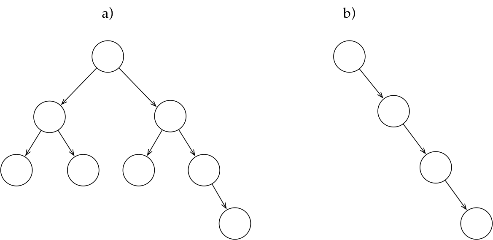

---

---

<a href="../Readme.md">Voltar</a>

<h2 id="desempenho">Desempenho</h2>
<h2 id="árvore-binária-balanceada">Árvore Binária Balanceada</h2>

Uma árvore binária balanceada (AVL) é uma árvore binária na qual as alturas das duas subárvores de todo nó nunca difere em mais de 1.

Se a probabilidade de pesquisar um dado for a mesma para todos os dados, uma árvore binária balanceada determinará a busca mais eficiente.

<h2 id="árvore-binária-não-balanceada">Árvore Binária Não Balanceada</h2>

O desbalanceamento ocorre quando:

O NÓ é inserido é um descendente esquerdo de um nó que tinha balanceamento de 1 ou Se ele for um descendente direito de um nó que tinha balanceamento de –1.

<h2 id="impactos">Impactos</h2>

Se uma árvore é balanceada, tanto no caso da inserção quando no caso da busca, a cada chamada recursiva do algoritmo, descartamos metade da árvore original. Portanto, a complexidade assintótica desses dois procedimentos é logarítmica no tamanho (número de nodos) da árvore. Na verdade, muitos procedimentos que operam sobre árvores binárias de pesquisa funcionam com base nessa mesma ideia de eliminar metade da árvore a cada etapa do procedimento. Isso ocorre por causa da natureza recursiva das árvores binárias de pesquisa e pela forma como os nodos são inseridos nelas.

Entretanto, se a árvore não for balanceada, não descartaremos metade da árvore original a cada chamada recursiva. Em casos como o da árvore não balanceada mostrada acima, a complexidade dos procedimentos de inserção e busca será linear no tamanho da árvore, pois, na prática, a árvore mostrada funciona como se fosse uma lista encadeada.

<h2 id="exemplo">Exemplo</h2>

A. Árvore Balanceada

B. Árvore não Balanceada

